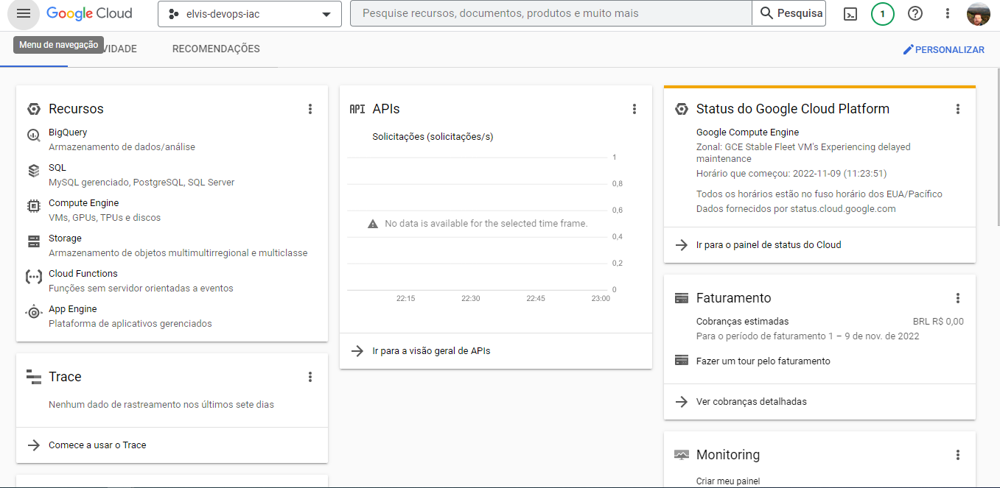
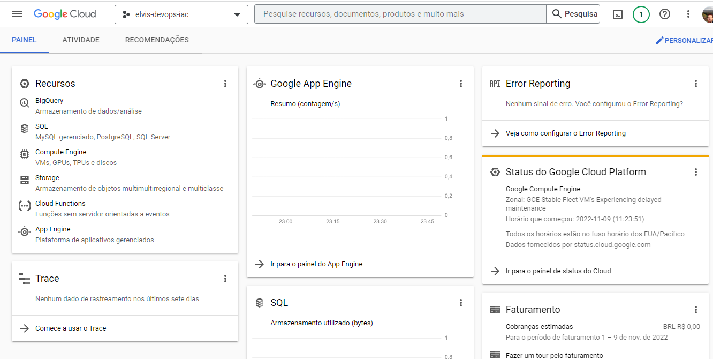
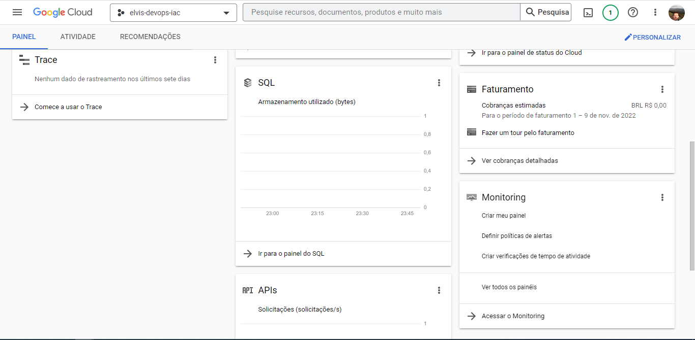
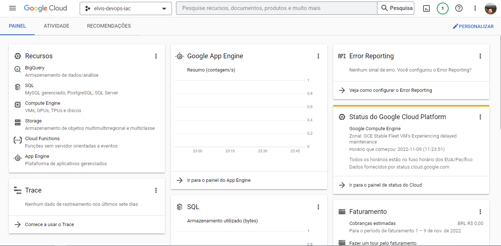
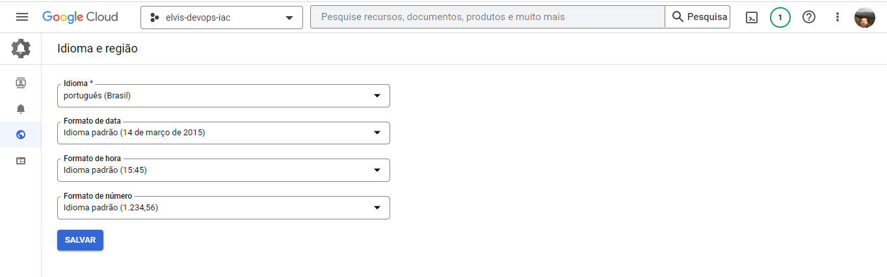
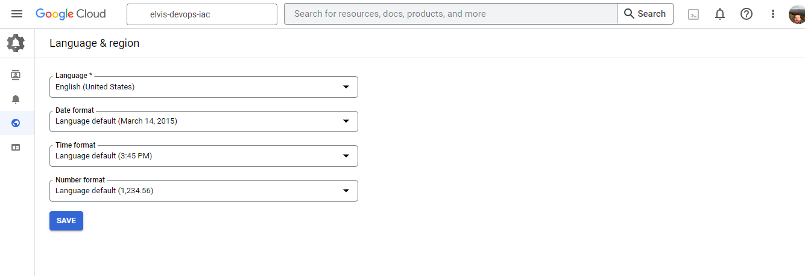
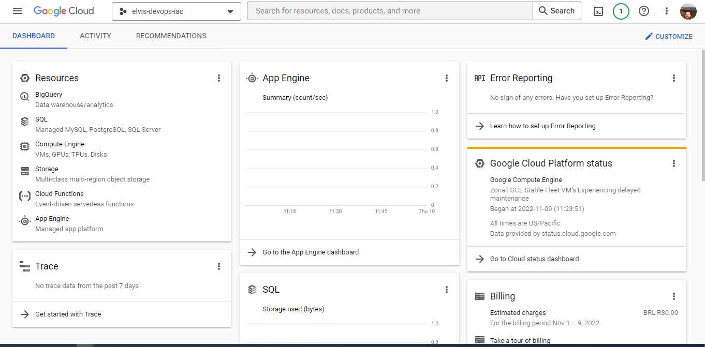

### Olá!!! 👋

  
 Esse repositório contém os prints das personalizações executadas no dasboard do GCP para o Desafio Personalizando Dashboard e Trocando as Preferências de Idioma.

  

 

📌 Dasboard SEM as Auterações:

 

 

📌 Dasboard COM as Auterações:

 

 

 

📌 Idioma em Português:

 

 

 

📌 Idioma Auterado para o Inglês:

 

 

 
