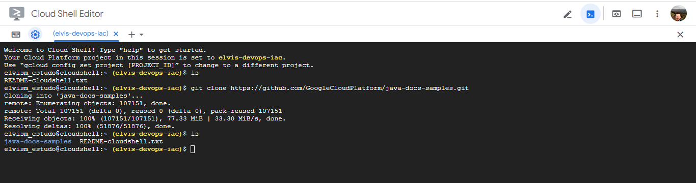
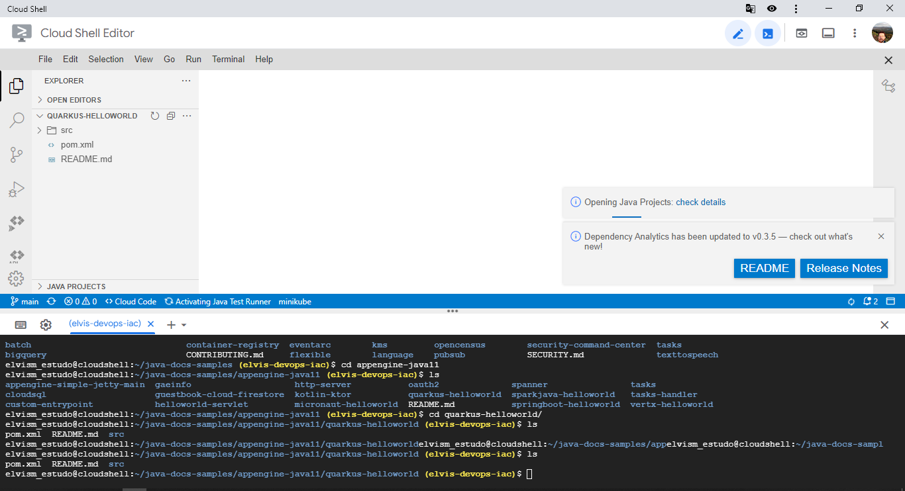
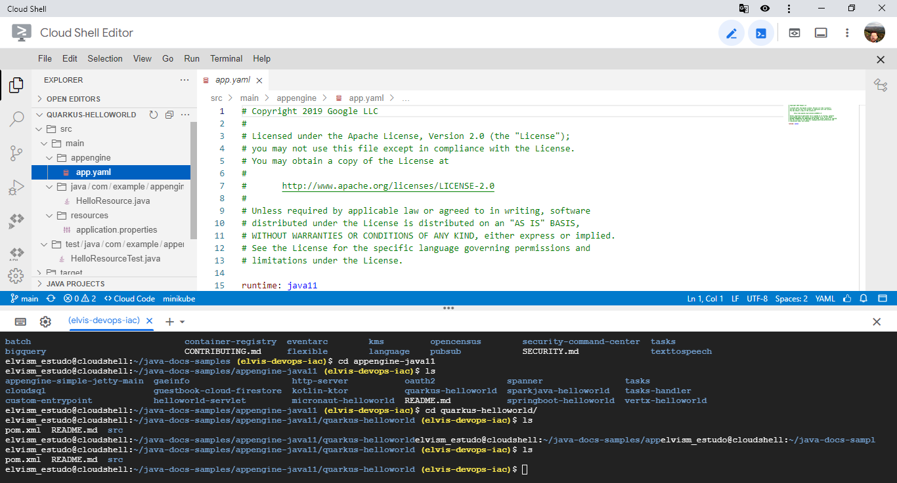
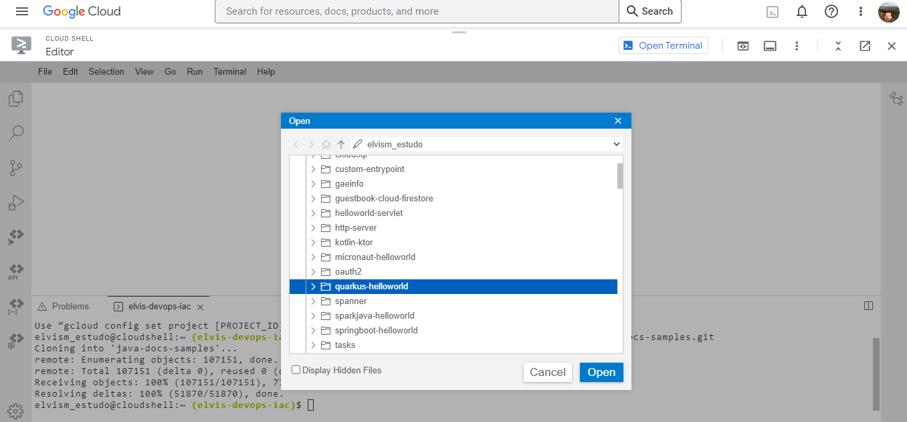
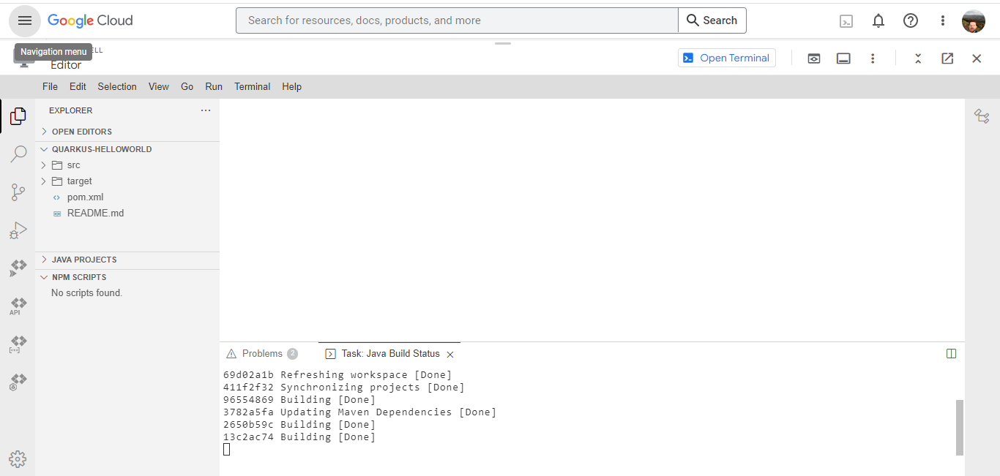
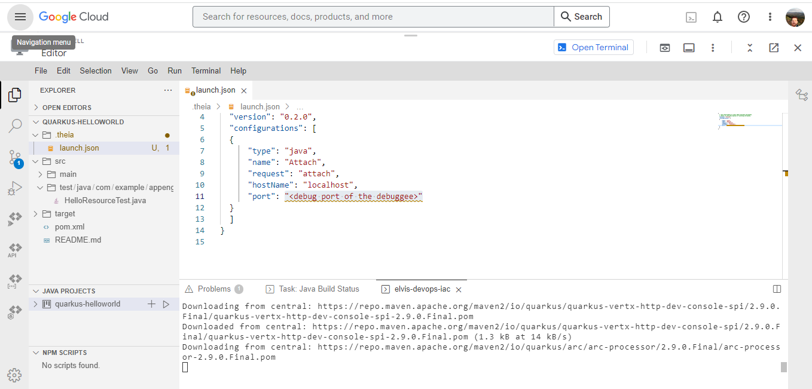
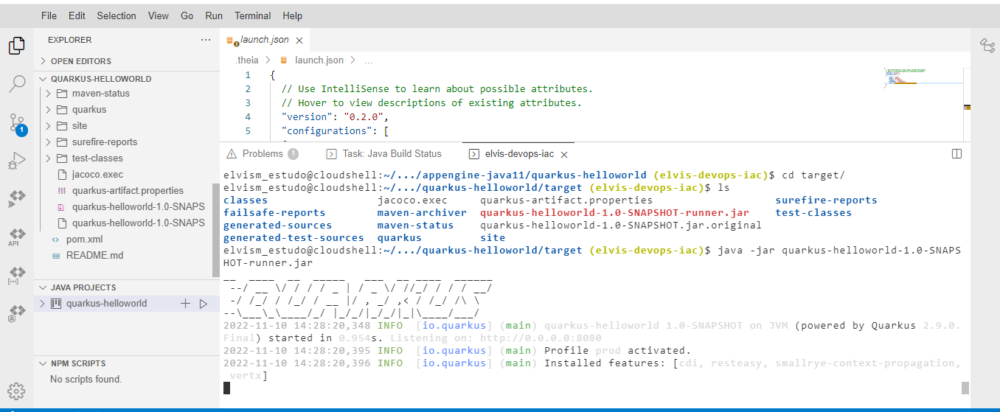
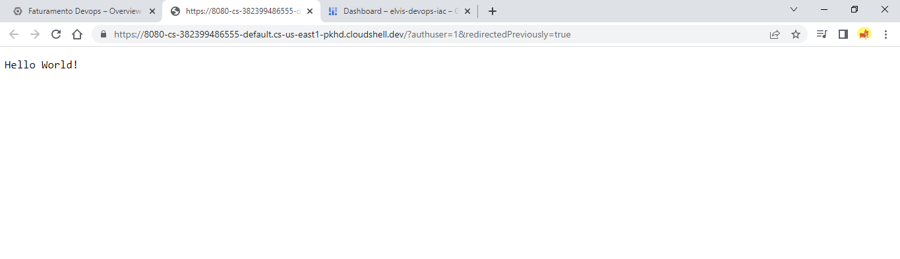

### Olá!!! 👋

  
 Esse repositório contém os prints demonstrando o uso do cloud shell.

  

 

📌 Clonando o repositório e abrindo o projeto:

 

 

 

 

📌 Acessando a pasta:

 

 

 

📌 Instalando o mvn e eacessando o diretório target:

 

 

 

📌 Aplicação em execução:

 

 

